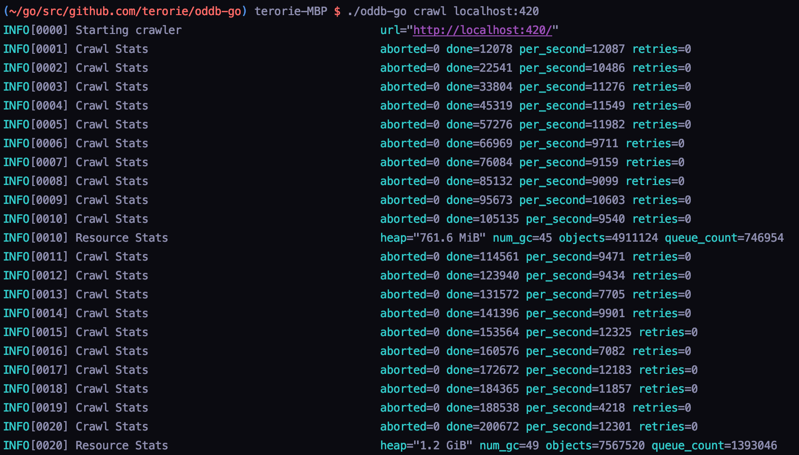

# oddb Go crawler 🚀
> by terorie 2018 :P

 * Crawls HTTP open directories (standard Web Server Listings)
 * Gets name, path, size and modification time of all files
 * Soon: Will work as a crawler for [OD-Database](https://github.com/simon987/od-database)!

Stress test crawling [pandoradir](https://github.com/terorie/pandoradir)
on an average laptop (~10K requests per second, 4 connections):

Memory usage is being optimized :P
